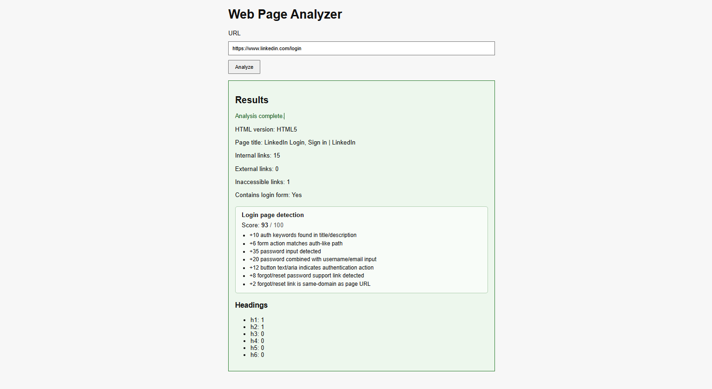

# Web Page Analyzer

This project analyzes a URL and returns structured information about the page:

- HTML version
- Page title
- Heading counts (`h1`-`h6`)
- Internal and external link counts
- Inaccessible links count
- Login-page detection (`hasLoginForm`, `loginScore`, `loginReason`)

The solution has two components:

- `api`: Go HTTP API (`/health`, `/analyze`)
- `web`: React + Vite frontend

## Screenshot



## Main Build/Run/Deploy Steps

### 1) Prerequisites

- Docker Desktop (recommended for full stack)
- Optional local development:
  - Go (for `api`)
  - Node.js + npm (for `web`)

### 2) Build and run with Docker Compose (recommended)

From repository root:

```bash
docker-compose up --build
```

Expected endpoints:

- Web UI: `http://localhost:3000`
- API: `http://localhost:5000`
- Health check: `http://localhost:5000/health`

Stop:

```bash
docker-compose down
```

### 3) Run tests

API tests (from `api` directory):

```bash
go test ./...
```

Notes:

- Running `go test ./...` from repository root fails because the Go module is inside `api`.
- Integration tests include live network calls (for example, real external URLs), so they depend on internet availability and external-site stability.

### 4) Local non-Docker run (optional)

API:

```bash
cd api
go run ./cmd/api
```

Web:

```bash
cd web
npm install
npm run dev
```

## Assumptions and Decisions

These are the implementation assumptions/decisions made where requirements were unclear or unspecified:

1. **CORS policy**

- Default `CORS_ORIGIN` is `http://localhost:3000` for local development.
- This assumes single known frontend origin in dev.

2. **Server-rendered HTML dependency**

- Analysis is based on the HTML returned by the HTTP response body.
- Pages that rely heavily on SPA frameworks or JavaScript DOM manipulation/rendering may not be fully represented in results.

3. **Link accessibility counting approach**

- The analyzer parses the HTML document once, collects resolvable HTTP/HTTPS link targets during that pass, and deduplicates them before checking accessibility.
- Link checks are executed in parallel using a bounded worker pool (`LinkCheckWorkerCount`) with a per-link timeout (`LinkCheckTimeoutPerURL`).
- `InaccessibleLinks` includes both links that are invalid at parse/classification time (for example empty or malformed `href`) and links that fail runtime accessibility checks (request error or non-2xx/3xx response).

4. **Login page detection strategy**

- Detection is heuristic and score-based (`loginScore`, `loginReason`), not a strict classifier.
- A threshold-like interpretation is used by tests (high score expected for known login pages).

## Suggestions for Improvement

1. **Performance and scalability**

- Add concurrency limits, optional caching for repeated URL checks, and benchmark parsing/link-check stages.

2. **Render JavaScript-heavy pages**

- Use a headless browser (Chromium with Playwright) to render SPA pages and capture the generated DOM/HTML before analysis.
- Keep the current fast HTTP fetch path as a default and enable browser rendering as an optional mode for accuracy-sensitive use cases.

3. **Vision-assisted login detection**

- Capture one or more browser screenshots during page rendering and analyze visual login cues (for example sign-in forms/buttons) in addition to HTML signals.
- Optionally call an AI vision service (such as an OpenAI-backed server) to improve detection accuracy on pages where DOM-based heuristics are ambiguous.
